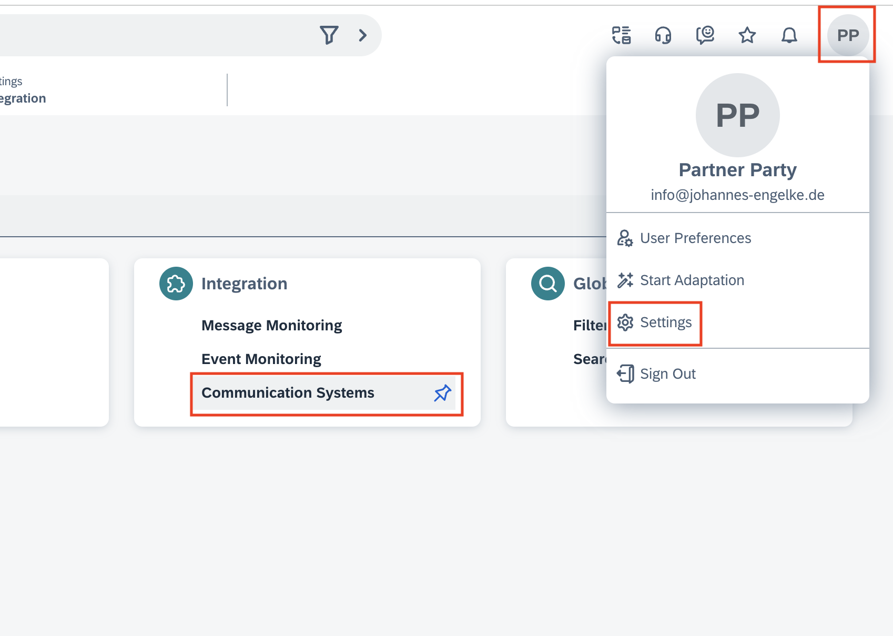

# Hands on side-by-side Extensibility

Welcome to the hands-on session. To begin the session, please ensure you have access to a hana trial account or the SAP BTP Application Studio and a Cloud Foundry Instance.

Prerequisites: 
-	[SAP BTP Trial](https://developers.sap.com/tutorials/hcp-create-trial-account.html)

## Scenario
Our Service Team is receiving frequently requests to remove personal data from the company databases. Currently the process is not fully automated, and the service team need to involve different teams via sub-case to fulfill the case. Our task is to automate this process, which can’t be solved inside the standard as of now.

## Solution Description
The solution will be implemented using event based side-by-side development on the SAP Business Technology Platform. We will create an web-service written in nodejs, which is waiting for Events triggered by Autoflow. The Service will create one sub-cases based on the main case.


*Architecture Overview*

For simplification we are not considering any security related matters. For a productive resolution the exposed web-service needs to be at least password protected. Also we recommend to use BTP best practices to harmonize the Extensibility Architecture across the project / company.

## Implementation

Before we can get started please assure you have signed up for a BTP Trial account or have access to a SAP BTP Cloud Foundry space and the SAP Business Application Studio.

- How to register for [SAP BTP Trial](https://developers.sap.com/tutorials/hcp-create-trial-account.html)

### Step 1: Environment Setup

For this workshop we will use the SAP Business Application Studio to develop a simple event processor and deploy the service to the SAP BTP Cloud Foundry Environment. For the environment Setup, first need to create a new Dev space in SAP Business Application Studio. Later we will import the sample project into the Dev Space.


*Open SAP Business Application Studio*


*Create new Dev Space*


*Select basic Application and hit create*


*Open the Dev Space as soon as the Space is marked as running*


*Clone Reposity*

Clone Repository:
- Click "Clone Repository
- Copy `https://github.com/joek/async-sample.git`
- Hit enter or click "Clone from URL..." below the input field

On the left side you will find a file browser including the project.


*Code review*

The project includes the following files:

- `app.js`: Service Code
- `package.json`: Required nodejs libraries
- `manifest.yml`: Deployment descriptor for cloud foundry

Your coding is going into the `app.js` file. We are exposing two endpoints. the `/health` endpoint is used to validate the service. In most cases it is not necesarry to implement this endpoint. During the training we use it to vaildate the setup before configuring Sales and Service Cloud V2.

The business logic is exposed via `/webhook`. We are validating if the case is of a certain type. If this is the case, we are sending a post request to create the related sub-case.

### Step 2: Configure Project and Deploy

As the coding of the project is done, we can start to configure and deploy it. To do so, we need to adjust the missing information in the deployment descriptor, connect the cloud foundry CLI and finaly deploy the application.

1. Retrieve the Cloud Foundry API Endpoint.


*Open the BTP Trial Account*


*Select the trial sub-account*


*Copy the Cloud Foundry API Endpoint*

2. Inside SAP Business Application Studio open the command line terminal. This can be done with the icon in the upper right corner. 


3. To Login, enter the following command. `cf login -a <endpoint url>` You need to replace the endpoint URL with the URL you retrieved in the steps before. Login using the emailadress and password of you BTP Trial Account.


*Cloud Foundry Login: If you are working on a fresh trial account, you are automaticaly logged in to the right org and space.*

4. As a final step before we can deploy the application, we need to provide the service configuration. Please replace the placeholder in the `manifest.yaml` file with the information provided to you during the workshop. Please select a suitable app name (it needs to be unique on BTP).


*Adjust manifest file with the information provided during the workshop*

5. After the setup is done, it is now time to deploy the application. To do so, simply run `cf push` in the command line terminal. This will upload the code, start three service instances on BTP and exposes it to the internet. You can find the URL of the service in the log output or using the command `cf routes`.


*You can find the service URL as part of the log output or using the command `cf routes`*

6. To test if everything is correct, please open the service health endpoint (`https://<service endpoint>/health`). If there is no error, everything is fine and you can continue to setup SAP Sales and Service Cloud V2. If there is a configuration problem, you will see an error response. Please check the configuration in you manifest file and push again. You can see the service logs by running `cf logs <application name>`.


*CF Application log*

### Step 3: Setup Sales and Service Cloud Version 2

In SAP Sales and Service Cloud V2 two configurations are required. The Webservice needs to be registered as outbound communication system and we need a autoflow rule to trigger the service everytime a new case of a certain type is created.

1. Create Communication system. Navigate to Settings -> Integration -> Communication System


*Navigate to Settings -> Integration -> Communication System*

2. Create a new communication system using the + icon on top of the table.

3. Set name and description and open the "Outbound" tab and click "create".


4. Set Protocol to `https`, as URL you are using the service domain from the cloud foundry application and authentication method is `none`.


5. Save and Activate the Communication System.

6. Navigate to the Autoflow connfiguration. (Settings -> Business Flow -> Autoflow)


*Navigate to Settings -> Business Flow -> Autoflow*

7. Create a new Autoflow rule using the (+) Button.

8. Please use your firstname to name the autoflow rule and select `case` as flow entity.


*Use your name to name the autoflow rule and select case as entity*

9. We will only create sub-cases if a case is newly created. Please ensure you select `Create Case` as event-type.


*Select `Create Case` event*

10. In the rules section, we ensure sub cases are only created for a certain case-type and if the subject is conatining a certain key word. Please ensure, you use an AND conditions.


*Configure rules using case-type and subject*

11. As output of the Autoflow we select `Send Event Notification`


*Select `Send event Notification` as flow action*

12. To configure the event notification we need to set the event name communication system and subscrib path. 

- Event Name: Some event name (not relevant in this case)
- Communication System: The communication system we created earlier
- Subscribe Path: `/webhook`


*Configure Event Notification*

13. Save the autoflow

14. Activate the autoflow

### Step 4: Test

In this step we will create a new case and validate, if the sub-case is created as expected.

1. Create Case: Navigate to the case list and click the "+" icon. You need fill out some basic information.
    - Case-Type: "Standard Case Type"
    - Title: The title needs to include the keyword / name you defined during the autoflow configuration.
    - You need to select an random account.
2. Click "Save and Open" To open the case


*Create Case: Please include the keyword configured in autoflow*

3. Open the "Related Entities" Tab. Maybe you need to refresh a few times. As the processing is async it might take a few seconds till the sub-case is created and showing up in the list.


*Validate if sub-case is created*

## Summary

In this development journey, we created a async side-by-side extension based on a real customer use-case. To make this classroom training we had to introduce a few shortcuts as well as spending more time on infrastructure setup. For customer projects it is important to have a extensibility architecture in place, which can be leveraged if needed. The extension patterns can give an indication for which scenarios to prepare and which infrastructure might be required. Due to the use of open industry standards, the extensibility architecture can be tailored to the needs of the customer and e.g. reuse existing components.

## Troubleshooting

In case the scenario is not working as expected there are multiple tools available for debugging.

Autoflows logs can be found inside the Autoflow List page behind the three dots at the top right of the page.


*Autoflow logs*

Service logs can be shown using the command line.

```
$ cf logs <app_name>
```

The health endpoint described in the deployment section can also provide an indication if the application setup is correct. The endpoint is also testing the connection to service cloud.


